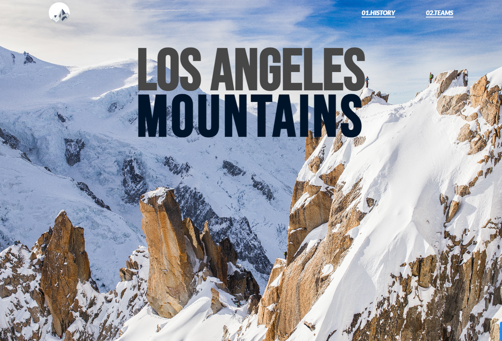

<a name="readme-top"></a>

<div align="center">

  
  <br/>

  <h2><b>LOS ANGELES MOUNTAINS</b></h2>

</div>

<!-- TABLE OF CONTENTS -->

# 📗 Table of Contents

- [📖 About the Project](#about-project)
  - [🛠 Built With](#built-with)
  - [🚀 Live Demo](#live-demo)
- [💻 Getting Started](#getting-started)
  - [Prerequisites](#prerequisites)
  - [Setup](#setup)
  - [Install](#install)
  - [Usage](#usage)
  - [Run tests](#run-tests)
- [👥 Authors](#authors)
- [🤝 Contributing](#contributing)
- [⭐️ Show your support](#support)
- [🙏 Acknowledgements](#acknowledgements)
- [📝 License](#license)

<!-- PROJECT DESCRIPTION -->

# 📖 Los Angeles Mountains <a name="about-project"></a>

Los Angeles Mountains is a comprehensive and dynamic single-page application built using React, Tailwind CSS, and Vite. The application is designed with a focus on usability, ease of navigation, and smooth interactions for users, ensuring a positive experience while using the hiking website.



</br>

## 🛠 Built With <a name="built-with"></a>

<details>
  <summary>Tech Stack</summary>
  <ul>
    <li>HTML</li>
    <li>CSS</li>
    <li>JavaScript</li>
    <li>Tailwind CSS</li>
    <li>React</li>
    <li>Vite</li>
  </ul>
</details>

<!-- LIVE DEMO -->

## 🚀 Live Demo <a name="live-demo"></a>

- [Live Demo](https://hunterx-7.github.io/angeles-mountains/)

<p align="right">(<a href="#readme-top">Back to top</a>)</p>

<!-- GETTING STARTED -->

## 💻 Getting Started <a name="getting-started"></a>

To get a local copy up and running, follow these steps.

### Prerequisites

- Node js
- Visual Studio Code
- Git Bash
- NPM installed locally

### Setup

Clone this repository to your desired folder:

```sh
git clone https://github.com/HunterX-7/angeles-mountains.git
```

### Install

Install this project with:

```sh
npm install
```

### Usage

To run the project, execute the following command:

```sh
npm run dev
```

<!-- AUTHORS -->

## 👥 Author <a name="authors"></a>

👤 **Francisco Quintero**

- GitHub: [@HunterX-7](https://github.com/HunterX-7)
- LinkedIn: [Francisco Quintero](https://www.linkedin.com/in/francisco-quintero-146423252/)

<!-- CONTRIBUTING -->

## 🤝 Contributing <a name="contributing"></a>

Contributions, issues, and feature requests are welcome!

Feel free to check the [issues page](https://github.com/HunterX-7/angeles-mountains/issues).

<!-- SUPPORT -->

## ⭐️ Show your support <a name="support"></a>

Give a ⭐️ if you like this project!

<!-- Acknowledgments -->

## 🙏 Acknowledgments <a name="acknowledgements"></a>

Hat tip to anyone whose code was used.

<!-- LICENSE -->

## 📝 License <a name="license"></a>

This project is [MIT](./LICENSE) licensed.

<p align="right">(<a href="#readme-top">Back to top</a>)</p>
